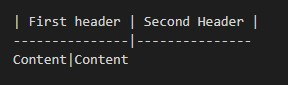

# *__Инструкция__*

## **Выделение текста**

*Курсив* (* текст *) или знак нижнего подчеркивания (_ текст _) _пример_.

**Полужирный** ( ** текст **) или двойной знак нижнего подчеркивания (__ текст __) __пример__.

Альтернативные способы существуют для совмещения :
курсив + полужирный .

>Пример : _**вот так вот**_

**Зачеркнутый** (По две тильды "~" до и после текста)

>Пример : ~~зачеркнутый~~

## **Списки**

* Список (ненумерной "*" или "+" _space_text)

Вложенные пункты создаются четырьмя пробелами перед маркером пункта:
+ Список

    + Вложение

1. Список (нумерной 1._space_text)

1. Список
    1. Вложение

## **Работа с изображениями**

Чтобы вставить изображение :
 
 
>**Конструкция : _( )_**

## **Ссылки в тексте**

Ссылка на [GitHub](https://github.com/)

>**Конструкция : _[ название ссылки(кнопка)]без пробела(URL)_**

## **Заголовки**
Заголовки пишем через  *#_text*

## **Цитаты**

Цитаты оформляются как в емейлах, с помощью символа ">"

 >Циатата 

>**Конструкция : _>"text"_**

## **Таблицы**

| First header | Second Header |
---------------|---------------
Content|Content

**Конструкция :**

>

